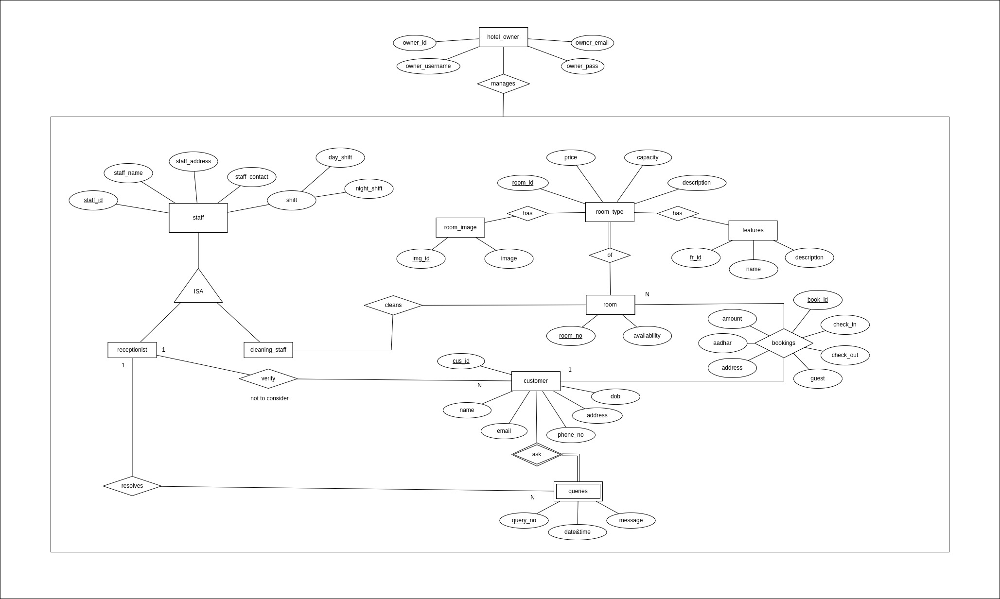

# happy_stay
Explanation of ER Diagram:  
- Each customer is identied by unique identifying-id i.e., customer-id, name,
email, phone no, address, DOB. These data must be recorded.
- Customer can generate a booking request which has to be recorded and it
includes request-id, check_in, check_out time, aadhaar number.
- For each booking request the payment process occurs and the invoice is
generated which is recorded by using transaction id , transaction data and
time, transaction amount.
- Customers can put their queries and they must be recorded by using query
no, date&time, and their message.
- These queries will be resolved by receptionist.
- Each customer will be veri ed by a receptionist and for each receptionist
their data must be recorded in form of staff_id, staff_name, staff_contact,
staff_address and their shift time ie day or night.
- Each veri ed customer will be provided a hotel room as per their
requirement.
- Each room will be uniquely identi ed by their room_id and their availability
should also be recorded.
- Different types of rooms are available in the hotel and room data will be
recorded using room_id, price, capacity, and their type description.
- Each rooms will be having some features which can be recorded using
feature_id, name, description.
- For each room type their images will also be stored which will be uniquely
identi ed using img_id and the corresponding image.
- A customer will be given a hotel room once the invoice is generated.
- There will be a cleaning staff which will be assigned the maintenance work
for the rooms and their details must be recorded using staff_id, staff_name,
staff_address, staff_contact, their shift timing ie day or night.
- There will be a hotel owner whose details such as owner_id, owner email,
owner_username, owner_password has to be recorded and who supervises
the complete process.

# ER Diagram

